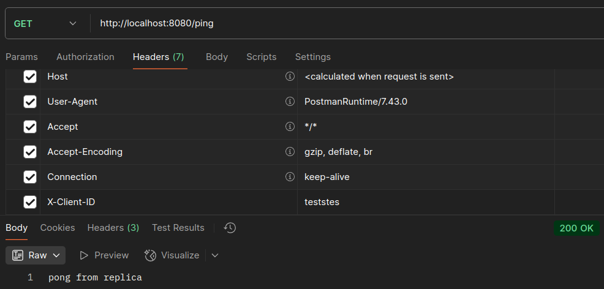
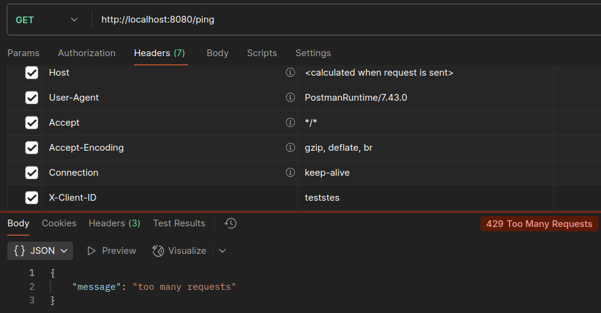
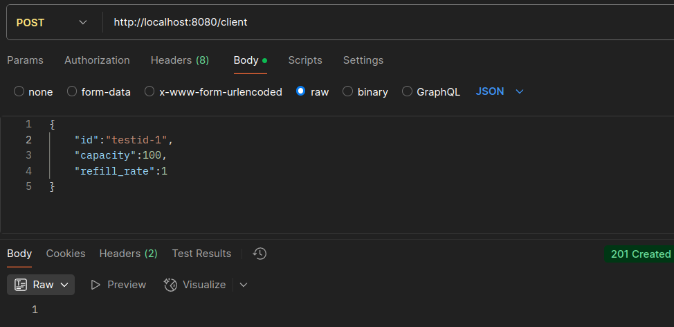
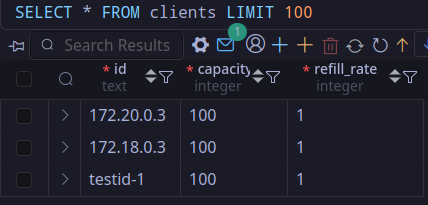

# load-balancer

Это простой балансировщик нагрузки, написанный в рамках тестового задания в cloud.ru.

- [load-balancer](#load-balancer)
	- [Ответы на вопросы для разогрева](#ответы-на-вопросы-для-разогрева)
	- [Архитектура](#архитектура)
	- [Обработка ошибок](#обработка-ошибок)
	- [Логи](#логи)
	- [Балансировщик](#балансировщик)
	- [Конфигурация](#конфигурация)
	- [Установка и запуск](#установка-и-запуск)
		- [Первый вариант](#первый-вариант)
		- [Второй вариант](#второй-вариант)
	- [Тестирование](#тестирование)
		- [Ручное тестирование](#ручное-тестирование)
			- [GET /ping](#get-ping)
			- [POST /client](#post-client)
		- [Нагрузочное тестирование](#нагрузочное-тестирование)
	- [Задачи](#задачи)

## Ответы на вопросы для разогрева

1. Самой интересной задачей за последние полгода была автоматизация создания аккаунтов и вход на них через закрытый API. Необходимо было написать 2 библиотеки для работы с этими API, после чего правильно их использовать на стороне сервера, чтобы запросы выполнялись корректно и без ошибок. Другой не менее интересной задачей, которая сейчас стоит передо мной, является создание своего формата файла для хранения чувствительных данных с быстрым поиском этих данных и возможностью хранить не только текст, но и другие файлы в сжатом и зашифрованном виде.
2. Один из моих крупных факапов был связан с развертыванием новой версии приложения, в котором использовалась база данных. Мы обновляли приложение и при этом проводили миграцию базы данных, чтобы добавить новые поля в таблицы и изменить структуру. Из-за этого некоторые запросы выполнялись в тестовой среде нормально, но не в продакшене. Это было связано с тем, как выполнялось применение миграций на сервере. В тестовой среде я просто сбрасывал базу и накатывал миграции с 0, но на сервере было иначе. Из-за этого некоторые индексы и таблицы оказались некорректными, из-за чего запросы стали падать с 500 ошибкой или просто долго выполнялись. Я изменил миграцию, чтобы она правильно применялась с текущей версии миграций.
3. Я ожидаю научиться писать более чистый и производительный код, познакомиться с новыми подходами и технологиями. В частности, мне хотелось бы углубить свои знания в области разработки распределённых систем, а также попрактиковаться в работе с такими инструментами, как Kubernetes. Дополнительно я надеюсь завести новые профессиональные знакомства.

## Архитектура

Архитектура проекта довольно проста.

Запросы идут на основной сервер, запущенный на `addr:port` (в моем услчае `localhost:8080` и `app:8080` в `docker`). Этот сервер принимает запросы на любые эндпоинты. В `ProxyMiddleware` выбирается по заданному в конфиге алгоритму доступный сервер-реплика. Запрос проксируется на этот сервер.

Я придерживался простоты и старался ничего не усложнять. Разбил проект на несколько основных модулей:

1. **app** - основной модуль приложения. `App` - контейнер, который содержит в себе все зависимости, которые надо `gracefully` выключать и запускать.
2. **balancer** - модуль с реализациями балансировщиков и интерфейсом балансировщика. Реализованы `round robin` и `least connections` балансировщики.
3. **client** - модуль фичи клиентов. Здесь располагается весь код, нужный для обработки запросов, связанных с клиентами.
4. **limitter** - модуль с `rate limitter`.
5. **pkg** - пакет с какими-то общими функциями, которые используются в разных местах. В данном случае только пакет `httpcommon`. 
6. **middleware** - модуль с реализациями мидлварок (логгер, прокси, лимитер).
7. **server** - модуль, в котором лежит реализация одного сервера-реплики.

**Почему интерфейсы `Balancer` и `Limitter` находятся в месте реализации, а не использования?**

Потому что интерфейс - контракт. Любой балансировщик должен иметь метод `Next()`. Использование единого интерфейса позволяет очень легко подменить реализацию, заменив вызов функции-конструктора в месте создания объекта. В местах, где используется балансировщик необходимо использовать не прямую реализацию, а интерфейс. Это позволяет не зависеть от конкретной реализации. Аналогично с лимитером.

Никаких агрегатов, DTO, ЧА, DDD и так далее. Обработчики вызывают методы базы напрямую, потому что в данном случае дополнительная прослойка в виде `service` будет оверхедом.

## Обработка ошибок

Здесь все очень просто - получили ошибку, ее и отдали. Если ошибка базы - отдадим ее в том виде, в котором и получили при вызове. Конечно, это не самый лучший подход и лучше бы не отдавать внутренние ошибки наверх.

## Логи

Для логов использовалась библиотека `zerolog`, а именно собственная обертка над этой библиотекой - `github.com/0x0FACED/zlog`.

## Балансировщик

Было реализовано 2 типа балансировщика: `Round Robin`, `Least Connections`.

Первый просто выбирает текущий сервер и инкрементирует счетчик.

Второй выбирает такой сервер, где меньше всего активных соединений.
Соединение является активным, пока не выполнился запрос. Это все реализовано в `ProxyMiddleware`.

Изначально при создании балансировщика все серверы являются неактивными. После запуска серверов запускается `job` на фоне, которая каждые несколько секунд пингует все серверы реплики. Для этой задачи используется минималистичный `worker pool`. 

Запрос будет прокситься только на тот сервер, который активен. Если сервер не активен - выбирается другой.

## Конфигурация

Конфигурация описана в `config/config.json`.

Весь конфиг с комментариями:

```json
{
	// Конфигурация сервера
	"server": {
		// host - адрес сервера (localhost или имя сервиса, если докер)
		"host": "app",
		"port": 8080,
		"max_connections": 100,
		"read_timeout": 5000,
		"write_timeout": 10000,
		"idle_timeout": 120000
	},
	// Конфигурация базы данных
	"database": {
		// Просто data source name для подключения к базе данных
		"dsn": "postgres://user:pass@db:5432/db?sslmode=disable"
	},
	// Конфигурация балансировщика
	"balancer": {
		// Тип балансировщика
		// least_conn или round_robin
		"type": "least_conn",
		// Конфигурация задачи для пингов серверов-реплик
		"healthcheck": {
			// Каждые interval делаем пинг (в мс)
			"interval": 2000,
			// Таймаут ожидания ответа (в мс)
			"timeout": 3000
		},
		// список серверов-реплик
		"backends": [
			"http://app:8081",
			"http://app:8082",
			"http://app:8083",
			"http://app:8084",
			"http://app:8085",
			"http://app:8086"
		]
	},
	// Конфигурация рейт лимитера
	"rate_limitter": {
		// Дефолтная вместимость одного бакета
		"capacity": 10,
		// Рейт для пополнения (сколько токенов за 1 тик добавляем)
		"rate": 1,
		// Интервал пополнения бакетов
		"refill_interval": 1000
	},
	// конфигурация логгера
	"logger": {
		// Уровень
		// debug, info, warn, error etc
		"level": "info",
		// не используется
		"logs_dir": "logs/app.log"
	}
}
```

## Установка и запуск

Есть два варианта:

1. go run/go build -> ./app
2. docker

### Первый вариант

1. Клонируем репозиторий:

```sh
https://github.com/0x0FACED/load-balancer.git
```

2. Настраиваем `config/config.json`.
3. Применяем миграции (например, через `golang-migrate/migrate`).
4. Запускаем через go run cmd/app/main.go или делаем билд и запускаем бинарник.

### Второй вариант

1. Клонируем репозиторий:

```sh
https://github.com/0x0FACED/load-balancer.git
```

2. Настраиваем `config/config.json`.
3. Создаем в корне `.env` и настраиваем согласно `.env.example`.
4. При необходимости изменяем `Dockerfile` и `docker-compose.yml`.
5. Запускаем через:

```sh
docker compose up --build
```

## Тестирование

Можно запустить unit тесты командой:

```sh
go test ./... -bench=. -race -cover
```

Написанные unit тесты не покрывают все сценарии.

Исходя из отчета, гонок данных нет.

### Ручное тестирование

#### GET /ping

Тестовый запрос для проверки жизни сервера:



В заголовках можно указать `X-Client-ID`, тогда он будет использоваться как ключ для бакетов `rate limiter`. Если же его не указывать, тогда будет использоваться `request.RemoteAddr` часть без порта.

Конфигурация для бакетов указана в `config.json`. При создании клиента можно указать свои параметры.

Выполним сразу много запросов:



При исчерпании всех токенов, будет ответ с 429 кодом и JSON ошибкой.

#### POST /client

Создадим нового клиента с кастомными настройками:



В базе следующее:



Теперь можно использовать этот `id` в заголовке `X-Client-ID`.

### Нагрузочное тестирование

Для нагрузочных тестов использовалась утилита `k6`.

Файл с тестом находится в корне проекта - `load_test.js`

Запуск нагрузочного теста:

```sh
k6 run load_test.js
```

Пример результатов нагрузочного теста:

```sh
     execution: local
        script: load_test.js
        output: -

     scenarios: (100.00%) 1 scenario, 50 max VUs, 1m10s max duration (incl. graceful stop):
              * default: Up to 50 looping VUs for 40s over 3 stages (gracefulRampDown: 30s, gracefulStop: 30s)


     ✓ status is 200 or 429

     checks.........................: 100.00% 17252 out of 17252
     data_received..................: 2.7 MB  67 kB/s
     data_sent......................: 1.7 MB  43 kB/s
     http_req_blocked...............: avg=6.63µs   min=1.41µs   med=4.9µs    max=1.82ms   p(90)=8.15µs   p(95)=9.52µs  
     http_req_connecting............: avg=530ns    min=0s       med=0s       max=958.81µs p(90)=0s       p(95)=0s      
     http_req_duration..............: avg=1.02ms   min=190.08µs med=801.98µs max=43.89ms  p(90)=1.65ms   p(95)=2.09ms  
       { expected_response:true }...: avg=3.73ms   min=1.05ms   med=2.08ms   max=43.89ms  p(90)=4.45ms   p(95)=13.03ms 
     http_req_failed................: 98.31%  16962 out of 17252
     http_req_receiving.............: avg=50.85µs  min=10.9µs   med=32.49µs  max=7.2ms    p(90)=70.33µs  p(95)=96.32µs 
     http_req_sending...............: avg=21.81µs  min=3.96µs   med=14.59µs  max=4.96ms   p(90)=28.43µs  p(95)=43.33µs 
     http_req_tls_handshaking.......: avg=0s       min=0s       med=0s       max=0s       p(90)=0s       p(95)=0s      
     http_req_waiting...............: avg=952.14µs min=166.76µs med=737.87µs max=43.79ms  p(90)=1.56ms   p(95)=1.98ms  
     http_reqs......................: 17252   431.162818/s
     iteration_duration.............: avg=101.73ms min=100.29ms med=101.56ms max=144.42ms p(90)=102.44ms p(95)=102.98ms
     iterations.....................: 17252   431.162818/s
     rate_limited...................: 98.31%  16962 out of 17252
     vus............................: 2       min=2              max=50
     vus_max........................: 50      min=50             max=50


running (0m40.0s), 00/50 VUs, 17252 complete and 0 interrupted iterations
default ✓ [======================================] 00/50 VUs  40s
```

Большинство запросов были с 429 кодом ошибки, потому что в тесте использовались обычные `/ping` запросы без создания кастомных клиентов в базе, а значит к ним применялись настройки из конфиге (дефолтные). Таким образом, `capacity` была всего лишь 10, `rate` пополнения 1, а количество токенов, изначально существовавших в каждом бакете - 1.

## Задачи

- [x] Реализовать HTTP-сервер, который принимает входящие запросы (например, на порту 8080).
- [x] При получении запроса балансировщик должен пересылать его на один из заранее заданных бэкенд-серверов. Адреса серверов можно задавать через конфигурационный файл или переменные окружения.
- [x] Использовать стандартный HTTP-пакет Go (`net/http`) для работы с запросами и для переадресации (`reverse proxy`, например, с использованием пакета `net/http/httputil`).
- [x] Реализовать алгоритм распределения запросов по бэкендам (минимум – `round-robin`).
- [x] Балансировщик должен корректно обрабатывать ситуацию, когда один или несколько бэкендов недоступны (выводить понятное сообщение об ошибке или перенаправлять запросы на работающие серверы).
- [x] Обеспечить одновременную обработку нескольких запросов с использованием горутин.
- [x] Гарантировать корректную работу в условиях конкурентных вызовов (избегать гонок данных).
- [x] Реализовать обработку ошибок при обращении к бэкендам.
- [x] Выводить понятные сообщения ошибок в лог (например, при недоступности сервера).
- [x] Реализовать базовое логирование входящих запросов, ошибок и событий (например, смены бэкенда при сбое одного из серверов). Можно использовать стандартный пакет `log` или другую библиотеку для логирования.
- [x] Балансировщик должен получать список бэкендов и порт для прослушивания через внешний конфигурационный файл (`JSON` или `YAML`) или через параметры командной строки.
- [x] Конфигурация должна быть независима от кода (изменения конфигурации без перекомпиляции).
- [x] Каждому клиенту (IP или API-ключ) выделяется отдельный bucket токенов.
- [x] Настройки `bucket`: количество токенов (емкость), скорость пополнения.
- [x] Запрос считается допустимым, если в bucket клиента есть токен. В противном случае — отклоняется.
- [x] Отслеживать состояние каждого клиента (IP/API-ключ)
- [x] Поддерживать возможность настройки разных лимитов для разных клиентов.
- [x] Настройки для разных клиентов можно сохранять в базе данных
- [x] Использовать `time.Ticker` для периодического пополнения токенов в `buckets`.
- [x] Гарантировать атомарность операций с токенами (проверка, извлечение, пополнение).
- [x] Методы обработки запросов и обновления состояния `buckets` должны быть потокобезопасными.
- [x] Обеспечить минимальные блокировки для максимизации производительности.
- [x] Архитектура проекта будет модульной: разделите код на логически обособленные пакеты (например, для логики распределения, работы с конфигурацией и реализации HTTP-сервера).
- [x] Приветствуется чистота кода, понятное и подробное комментирование, а также применение интерфейсов для упрощения замены реализаций.
- [x] Оценка задания будет проводиться не только на основе реализованного функционала, но и на основе качества кода (структурирование, тестируемость, документация).
- [x] Напишите `Dockerfile` и `docker-compose.yml` для развертывания сервиса и БД
- [ ] Добавите интеграционные тесты с использованием `go test -bench=. -race`.
- [x] Пример нагрузки через Apache Bench (`ab -n 5000 -c 1000 http://localhost:8080/`).
- [x] Помимо `round-robin`, реализовать или предусмотреть возможность использования алгоритмов `«least connections»` или случайного распределения запросов.
- [x] Добавить механизм периодических проверок состояния каждого бэкенд-сервера.
- [x] При обнаружении недоступного сервера временно исключать его из пула, а при восстановлении работы возвращать обратно.
- [x] Реализовать корректное завершение работы балансировщика (обработка сигнала `SIGINT` или `SIGTERM`), чтобы завершить обработку текущих запросов без потери данных.
- [x] API для добавления/удаления клиентов (IP/API-ключей) и настройки их лимитов.
- [x] Пример эндпоинта: `POST /clients { "client_id": "user1", "capacity": 100, "rate_per_sec": 10 }`
- [x] Сохранять состояние клиентов (текущие токены, настройки) в БД или файле.
- [x] Использовать конфигурационный файл для дефолтных лимитов.
- [x] Возвращать структурированные JSON-ошибки с кодом и описанием.
- [x] Пример: `{ "code": 429, "message": "Rate limit exceeded" }`
